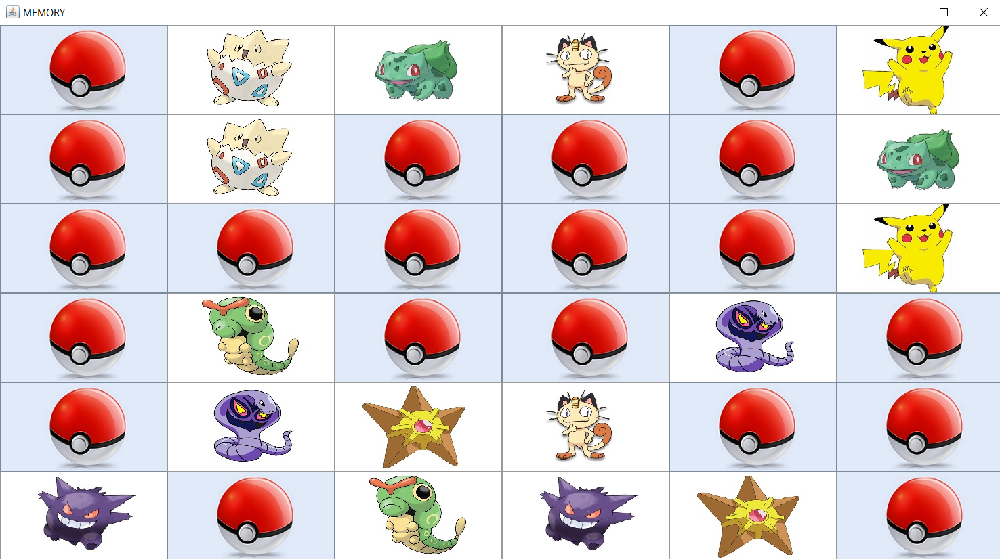

# **Pokemon Memory**

Memory game. User is revealing pokemon picture by clicking tile. Each picture has his copy hidden among one of the other tiles.
Purpose of the game is searching for matching pictures. Memorizing location of pictures under tiles helps with further matching.
User wins when all pictures are found and paired.

Game looks like:

